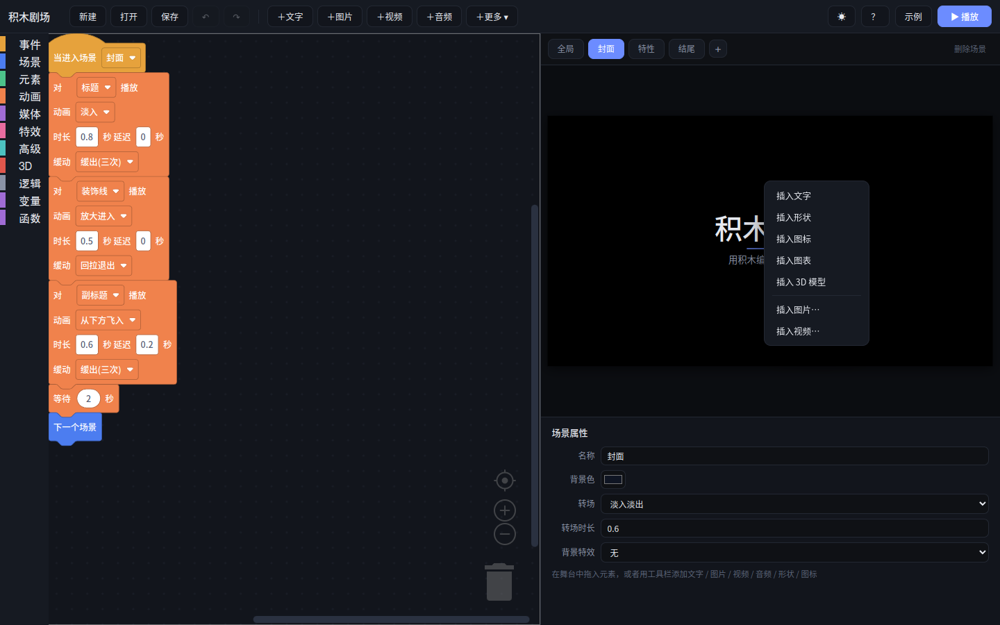
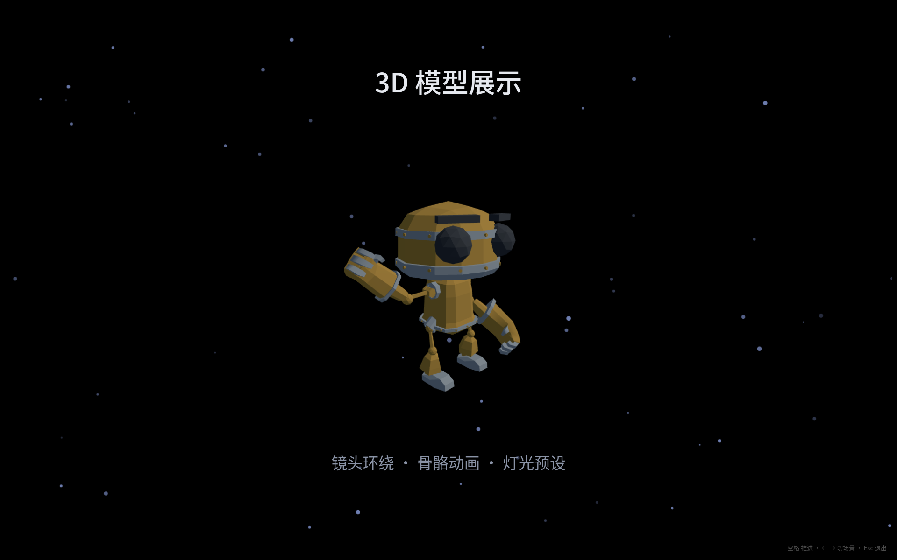
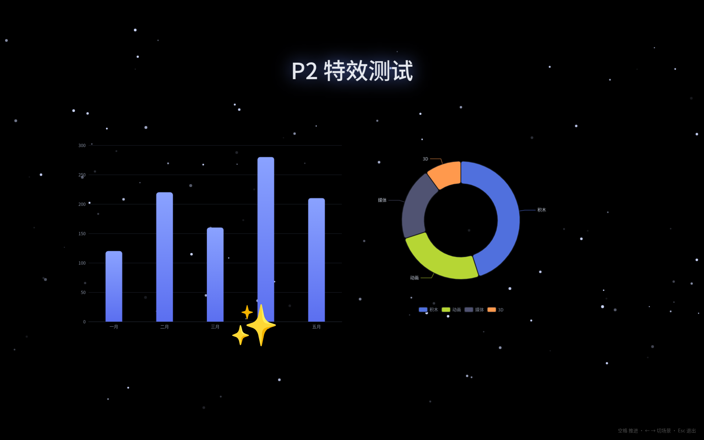
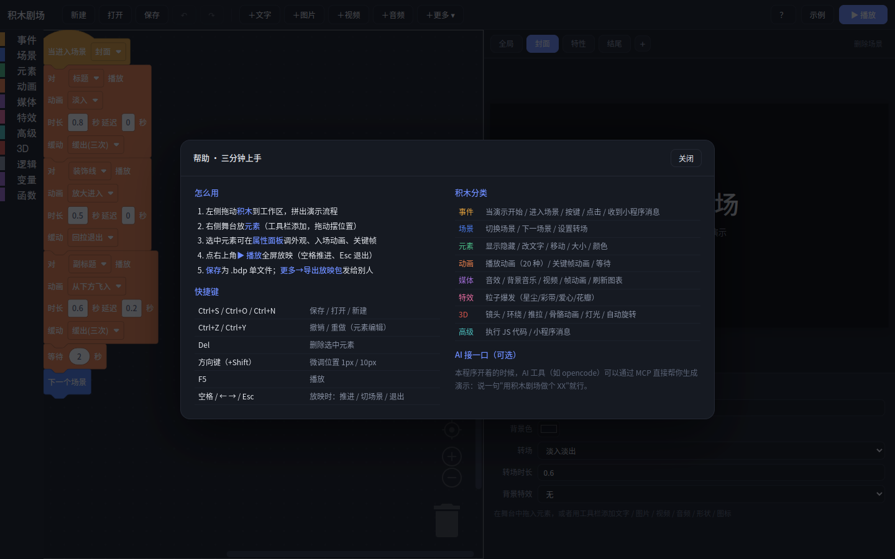
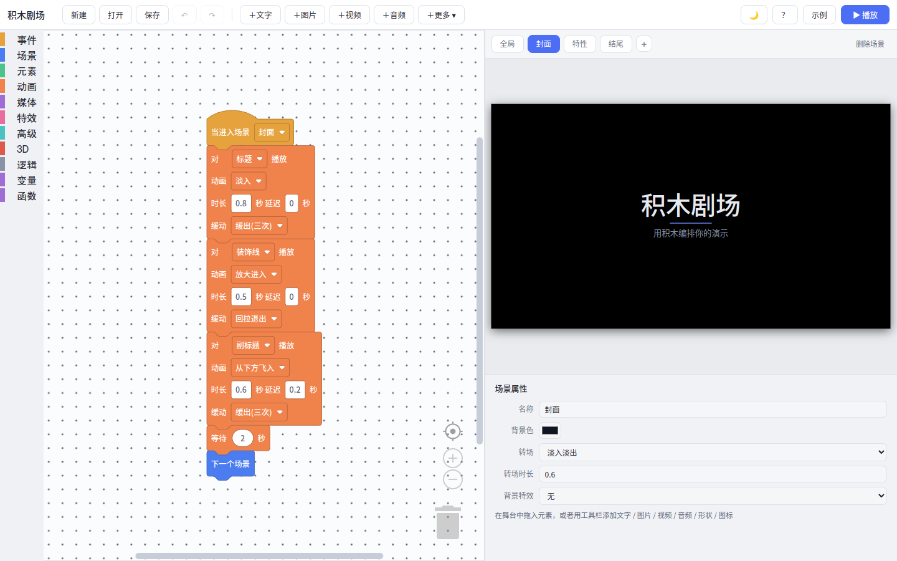

# 积木剧场（Jimuchang）

> 用图形化积木编排带 2D/3D 动画的演示 —— **"Scratch 的手感 + PPT 的舞台"**。
> 拖积木定义演示流程，一键全屏放映，还能导出单文件网页放映包发给任何人。



## 功能亮点

- **三栏编辑界面**：Blockly 积木工作区 + 舞台预览 + 属性面板；深色 / 浅色主题一键切换
- **10 种演示元素**：文字、图片、视频、音频、形状、emoji 图标、图表（ECharts）、帧动画（雪碧图/序列帧）、3D 模型（Three.js + 骨骼动画）、网页小程序
- **60 块中文积木**：事件 / 场景 / 元素 / 运动（滑行/步数/转向）/ 感知（读属性/计时器/随机色）/ 动画 / 媒体 / 特效 / 3D / 高级，外加逻辑、变量、函数（含返回值）与**说话气泡**
- **三层动画体系**：入场预设（20 种动画 + 12 条缓动）→ 积木命令 → **关键帧动画编辑器**（5 条属性轨道，打点补间）
- **特效库**：元素光效（光晕/霓虹/扫光/故障）、场景背景（星空/飘雪/微粒/极光）、粒子爆发（星尘/彩带/爱心/花瓣）
- **精彩的放映体验**：全屏、场景转场（8 种）、点击/按键交互、光标自动隐藏
- **单文件项目**：`.bdp`（内部 zip 打包全部素材），换电脑/发微信不丢资源
- **导出放映包**：生成单个 HTML 文件，浏览器双击即放，可交互、无需安装
- **导出为 PPT**：可编辑模式（重建为 PPT 原生对象 + 动画自动转换）/ 高保真模式（逐页截图）
- **对象编程**：克隆体系统（创建实例 / 当克隆体启动 / 本克隆体自我引用 / 销毁）
- **本地 AI 接口**：内置 HTTP API + MCP 服务器（23 个工具），AI 助手可直接生成、修改、截图自检演示

## 更多截图

| 3D 模型展示 | 图表与特效 |
|---|---|
|  |  |

| 内置帮助 | 浅色主题 |
|---|---|
|  |  |

## 快速开始

### 依赖

- **Qt 6.5+**：Widgets、WebEngineWidgets、WebChannel、HttpServer、WebSockets
- **CMake** 3.16+、支持 C++17 的编译器（GCC 12 测试通过）
- 前端依赖（Blockly / Three.js / ECharts / JSZip）已内置在 `web/vendor/`，**无需 npm**

### 构建

```bash
git clone https://github.com/YanZhen-Huang/jimuchang.git
cd jimuchang
cmake -B build -DCMAKE_BUILD_TYPE=Release
cmake --build build -j$(nproc)
./build/jimuchang
```

### 安装（Linux）

```bash
cp build/jimuchang ~/.local/bin/
# 桌面快捷方式与图标见 assets/
```

## 使用

1. 打开程序 → 点「示例」加载内置演示 → 「▶ 播放」全屏放映（空格推进、Esc 退出）
2. 自己做：左侧拖积木编排流程；舞台用工具栏「＋」添加元素；选中元素在属性面板调外观/动画/关键帧
3. `Ctrl+S` 保存为 `.bdp`；「＋更多 → 导出放映包」生成可分享的 HTML

完整说明见 **[docs/使用文档.md](docs/使用文档.md)**（产品设计细节见 [docs/技术文档.md](docs/技术文档.md)）。

## AI 接口（可选）

程序运行时会在 `127.0.0.1:17800` 开启本地 API（令牌见 `~/.config/jimuchang/api.json`）。

配合 MCP 服务器（`tools/jimuchang-mcp`），支持 MCP 的 AI 客户端（opencode / Codex 等）可以直接：

```
你：用积木剧场做个介绍太阳系的演示
AI：（调用 23 个 MCP 工具）建场景 → 放元素 → 写积木脚本 → 截图自检 → 导出放映包
```

## 项目结构

```
jimuchang/
├── src/                # C++ 外壳（Qt6 WebEngine 壳 + 文件/全屏桥 + HTTP API 服务器）
├── web/                # 前端（编辑器 + 舞台引擎 + 播放器）
│   ├── js/             #   easing / project / stage / elements / animations /
│   │                   #   blocks(积木+IR编译) / executor(IR执行) / keyframes /
│   │                   #   effects / sprites / three-scene / jimu-api / player ...
│   ├── vendor/         #   Blockly / Three.js / ECharts / JSZip（内置）
│   └── assets/         #   内置 3D 模型等
├── docs/               # 技术文档 / 使用文档 / 各期开发报告
└── CMakeLists.txt
```

## 技术要点

- **积木编译成 IR 指令**（不生成 JS），解释执行；导出放映包时预编译，播放器无需 Blockly
- **qrc 单文件发布**：全部前端资源编译进可执行文件，运行时零外部依赖
- **qrc 下 fetch 不可用**的规避：3D 模型经 QWebChannel 读取 → ArrayBuffer → `GLTFLoader.parse`；导出包用 Blob URL 链解决 ESM 依赖
- **本地 API 回调模式**：绕过 `runJavaScript` 不解析 Promise 的限制，经 QWebChannel 回传结果

## 开发历程

| 阶段 | 内容 | 报告 |
|---|---|---|
| P0 | 技术验证（WebEngine/Blockly/视频/截图） | [报告](docs/P0验证报告.md) |
| P1 | 核心闭环（编辑器/积木/播放/存取） | [报告](docs/P1报告.md) |
| P2 | 媒体与特效（音视频/图表/帧动画/特效库/撤销重做） | [报告](docs/P2报告.md) |
| P3-P6 | 关键帧 / 3D+自制程序 / AI 接口 / 导出放映包 | [报告](docs/P3-P6报告.md) |
| P7 | 打磨（辅助线/帮助页/浅色主题/最近文件/右键菜单/性能等） | [报告](docs/P7报告.md) |

## 许可

[MIT](LICENSE) © 2026 YanZhen-Huang
