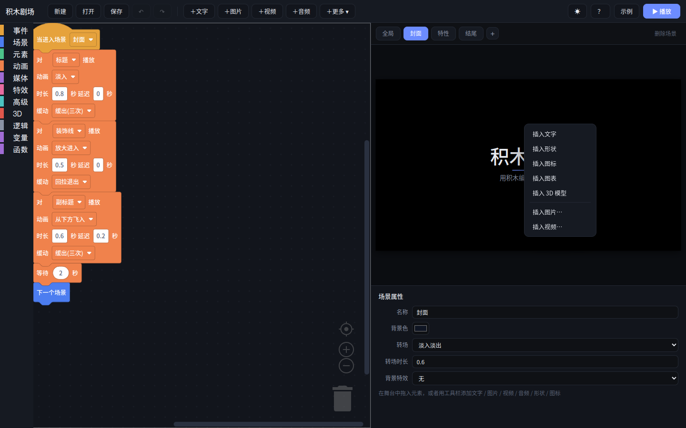
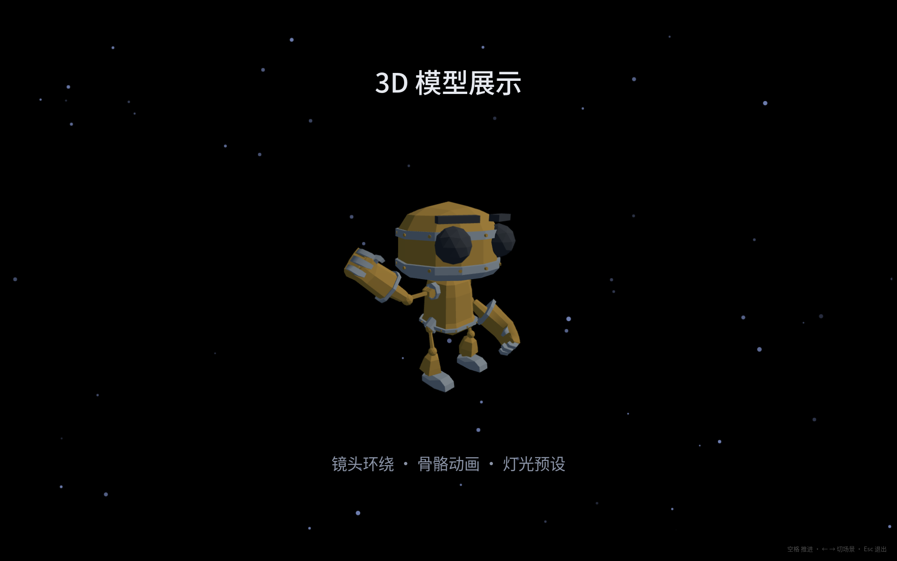
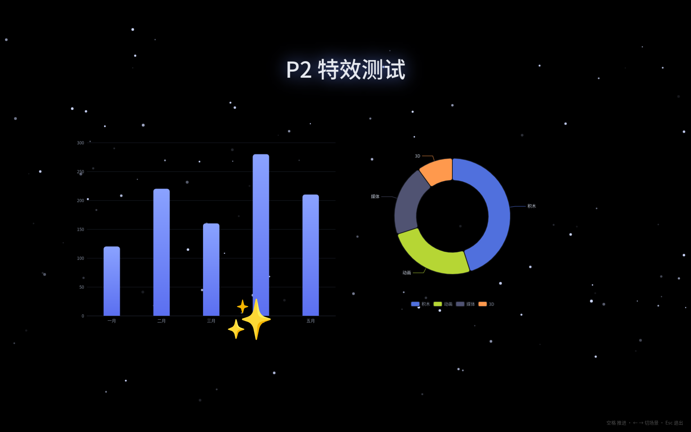
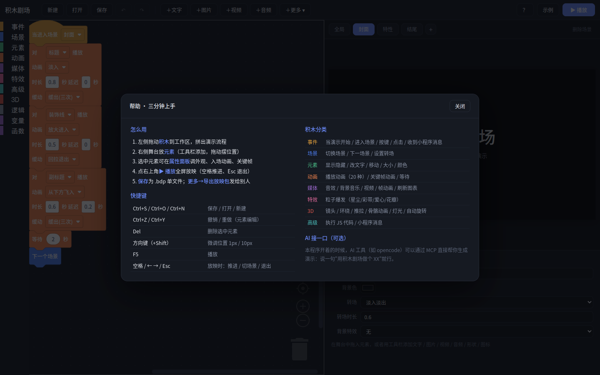
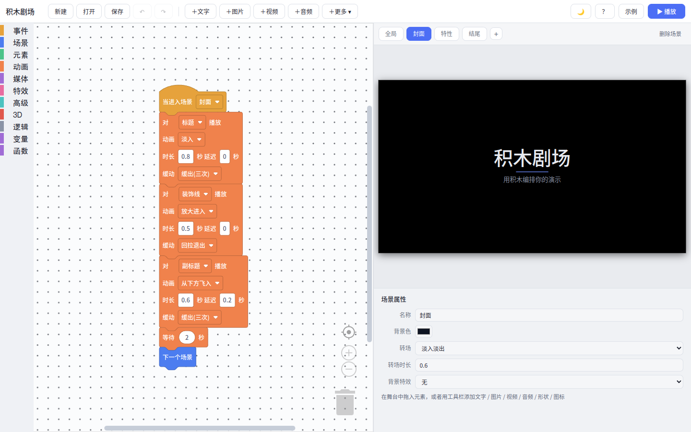

# 积木剧场（Jimuchang）

> 用图形化积木编排带 2D/3D 动画的演示 —— **"Scratch 的手感 + PPT 的舞台"**。
> 拖积木定义演示流程，一键全屏放映，还能导出单文件网页放映包发给任何人。
>
> 🎉 **v2.1.0**：**交互三件套**——**滑块**控件（观众拖参数）、**图表数据读写 + 图表点击**（点柱条切数据 / 看详情）、**悬停事件**（移入 / 移出）；元素脚本可操作**其他元素**（新「其他元素」分类）；新增**报价单 / 抛体实验 / 数据看板**三个可交互模板；修复"点击被上层文字挡住不触发"（命中穿透）<br>
> **v2.0.6**：新增**导出为视频**——自动录制整场演示 → MP4（720p / 1080p、24 / 30 fps、系统 ffmpeg H.264 合成）<br>
> **v2.0.5**：修复**元素条溢出**——元素多时用两端 ‹ › 箭头或滚轮触达后面的元素，选中项自动滚入视野<br>
> **v2.0.4**：新增**可调布局**——积木区拖宽 / Ctrl+B 收起（收起后舞台占满整屏）、属性面板折叠，布局自动记忆；修复灯笼遮挡工具栏<br>
> **v2.0.3**：新增**画布缩放与平移**（Ctrl+滚轮缩放、空格拖动平移，像专业编辑器一样）、**新用户入口**（启动首屏 / 4 个开箱模板 / 另存为）、**内核行为治理**（接管浏览器默认快捷键、GPU 花屏自救开关）<br>
> **v2.0.2**：新增 **✨ AI 助手**（一句话生成演示）、**触屏适配**（手机滑动切章节）、**导出压缩**（大图自动瘦身 70%+）、PPT 局限提示<br>
> **v2.0.1 · 元素中心**：每个元素拥有独立脚本（当开始/当点击我/当克隆体启动/当收到消息）；舞台连续化——章节切换是平滑过渡而非重建；积木库扩充至 **157 块**（数据列表 / 画笔 / 音乐 / 广播 / 带参函数 / 积木搜索），新增**设置面板**与**国庆专属主题**（烟花 + 金粒子 + 红灯笼）。方案见 [docs/元素中心重构方案.md](docs/元素中心重构方案.md)。



## 功能亮点

- **三栏编辑界面**：Blockly 积木工作区 + 舞台预览 + 属性面板；深色 / 浅色 / **国庆专属**（烟花+金粒子+红灯笼）主题
- **11 种演示元素**：文字、图片、视频、音频、形状、emoji 图标、**滑块**、图表（ECharts）、帧动画（雪碧图/序列帧）、3D 模型（Three.js + 骨骼动画）、网页小程序
- **174 块中文积木**：事件（含**广播 / 滑块值改变 / 悬停 / 图表点击**）/ 章节 / 元素 / 运动 / 外观 / 动画 / 克隆 / 媒体（含**音乐**与**图表数据读写**）/ 侦测（鼠标/碰撞/询问/滑块值）/ 数学 / 文本 / 数据列表 / 画笔 / 3D / 特效 / 逻辑 / 变量 / **带参函数**；元素脚本拥有**自我版积木**（不选元素，直接写"我"）
- **可交互演示**：滑块调参数（教学实验）、点卡片/按钮切数据（销售演示）、点图表柱条看详情（数据看板）、悬停反馈——观众动手玩，不只是看
- **效率工具**：**Ctrl+F 积木搜索**、**设置面板**（编辑器/播放导出/渲染性能/高级四组）、对齐辅助线、**可调布局**（积木区拖宽 / Ctrl+B 收起、属性面板折叠）
- **画布视图**：**Ctrl+滚轮缩放**（指针为锚点）、空格 / 中键拖动平移、Ctrl+0 适应窗口、Ctrl+1 回到 100%——放大做精细排版，缩小看全局
- **新用户入口**：启动首屏（空白 / 示例 / AI / 模板 / 最近文件）、7 个「点开就能改」的模板（含 3 个可交互：💰 报价单 / 🧪 抛体实验 / 📈 数据看板）、另存为
- **三层动画体系**：入场预设（20 种动画 + 12 条缓动）→ 积木命令 → **关键帧动画编辑器**（5 条属性轨道，打点补间）
- **特效库**：元素光效（光晕/霓虹/扫光/故障）、场景背景（星空/飘雪/微粒/极光）、粒子爆发（星尘/彩带/爱心/花瓣）
- **精彩的放映体验**：全屏、场景转场（8 种）、点击/按键交互、光标自动隐藏
- **单文件项目**：`.bdp`（内部 zip 打包全部素材），换电脑/发微信不丢资源
- **导出放映包**：生成单个 HTML 文件，浏览器双击即放，可交互、无需安装
- **导出为 PPT**：可编辑模式（重建为 PPT 原生对象 + 动画自动转换）/ 高保真模式（逐页截图）
- **导出为视频**：自动录制整场演示 → MP4（720p / 1080p、24 / 30 fps；逐帧抓取 + ffmpeg H.264，暂无声）
- **对象编程**：克隆体系统（创建实例 / 当克隆体启动 / 本克隆体自我引用 / 销毁）
- **✨ AI 助手**：一句话生成演示（如"做一个介绍国庆节的演示，标题+三个要点配图标，结尾放烟花"），自动搭建元素/章节/动画（DeepSeek，Key 填在设置里）
- **本地 AI 接口**：内置 HTTP API + MCP 服务器（23 个工具），外部 AI 可直接生成、修改、截图自检演示
- **手机也能看**：放映包支持触屏——左右滑动切章节、手指拖动元素

## 更多截图

| 3D 模型展示 | 图表与特效 |
|---|---|
|  |  |

| 内置帮助 | 浅色主题 |
|---|---|
|  |  |

## 快速开始

### 依赖

- **Qt 6.5+**：Widgets、WebEngineWidgets、WebChannel、HttpServer、WebSockets
- **CMake** 3.16+、支持 C++17 的编译器（GCC 12 测试通过）
- 前端依赖（Blockly / Three.js / ECharts / JSZip）已内置在 `web/vendor/`，**无需 npm**

### 构建

```bash
git clone https://github.com/YanZhen-Huang/jimuchang.git
cd jimuchang
cmake -B build -DCMAKE_BUILD_TYPE=Release
cmake --build build -j$(nproc)
./build/jimuchang
```

### 安装（Linux）

```bash
cp build/jimuchang ~/.local/bin/
# 桌面快捷方式与图标见 assets/
```

## 使用

1. 打开程序 → 点「示例」加载内置演示 → 「▶ 播放」全屏放映（空格推进、Esc 退出）
2. 自己做：左侧拖积木编排流程；舞台用工具栏「＋」添加元素；选中元素在属性面板调外观/动画/关键帧
3. `Ctrl+S` 保存为 `.bdp`；「＋更多 → 导出放映包」生成可分享的 HTML

完整说明见 **[docs/使用文档.md](docs/使用文档.md)**（产品设计细节见 [docs/技术文档.md](docs/技术文档.md)）。

## AI 接口（可选）

程序运行时会在 `127.0.0.1:17800` 开启本地 API（令牌见 `~/.config/jimuchang/api.json`）。

配合 MCP 服务器（`tools/jimuchang-mcp`），支持 MCP 的 AI 客户端（opencode / Codex 等）可以直接：

```
你：用积木剧场做个介绍太阳系的演示
AI：（调用 23 个 MCP 工具）建场景 → 放元素 → 写积木脚本 → 截图自检 → 导出放映包
```

## 项目结构

```
jimuchang/
├── src/                # C++ 外壳（Qt6 WebEngine 壳 + 文件/全屏桥 + HTTP API 服务器）
├── web/                # 前端（编辑器 + 舞台引擎 + 播放器）
│   ├── js/             #   easing / project / stage / elements / animations /
│   │                   #   blocks(积木+IR编译) / executor(IR执行) / keyframes /
│   │                   #   effects / sprites / three-scene / jimu-api / player ...
│   ├── vendor/         #   Blockly / Three.js / ECharts / JSZip（内置）
│   └── assets/         #   内置 3D 模型等
├── docs/               # 技术文档 / 使用文档 / 各期开发报告
└── CMakeLists.txt
```

## 技术要点

- **积木编译成 IR 指令**（不生成 JS），解释执行；导出放映包时预编译，播放器无需 Blockly
- **qrc 单文件发布**：全部前端资源编译进可执行文件，运行时零外部依赖
- **qrc 下 fetch 不可用**的规避：3D 模型经 QWebChannel 读取 → ArrayBuffer → `GLTFLoader.parse`；导出包用 Blob URL 链解决 ESM 依赖
- **本地 API 回调模式**：绕过 `runJavaScript` 不解析 Promise 的限制，经 QWebChannel 回传结果

## 开发历程

| 阶段 | 内容 | 报告 |
|---|---|---|
| P0 | 技术验证（WebEngine/Blockly/视频/截图） | [报告](docs/P0验证报告.md) |
| P1 | 核心闭环（编辑器/积木/播放/存取） | [报告](docs/P1报告.md) |
| P2 | 媒体与特效（音视频/图表/帧动画/特效库/撤销重做） | [报告](docs/P2报告.md) |
| P3-P6 | 关键帧 / 3D+自制程序 / AI 接口 / 导出放映包 | [报告](docs/P3-P6报告.md) |
| P7 | 打磨（辅助线/帮助页/浅色主题/最近文件/右键菜单/性能等） | [报告](docs/P7报告.md) |
| R1-R4 | 元素中心重构（元素独立脚本 / 连续舞台 / 章节书签 / 广播 / 带参函数） | [R1](docs/R1报告.md) · [R2](docs/R2报告.md) |
| S1-S3 | 设置面板 / 积木补全（157 块）/ 积木搜索 / 国庆主题 | [S1](docs/S1报告.md) · [S2](docs/S2报告.md) · [S3](docs/S3报告.md) |
| v2.0.3 | 新用户入口 / 画布缩放平移 / 内核行为治理 / 回归测试脚本 | [问题与改进清单](docs/问题与改进清单.md) |
| v2.0.4 | 可调布局（积木区拖宽 / 收起、属性面板折叠） | [问题与改进清单](docs/问题与改进清单.md) |
| v2.0.5 | 元素条溢出修复（箭头 / 滚轮 / 自动滚入视野） | [问题与改进清单](docs/问题与改进清单.md) |
| v2.0.6 | 导出为视频（MP4 自动录制） | [使用文档](docs/使用文档.md) |

## 许可

[MIT](LICENSE) © 2026 YanZhen-Huang
